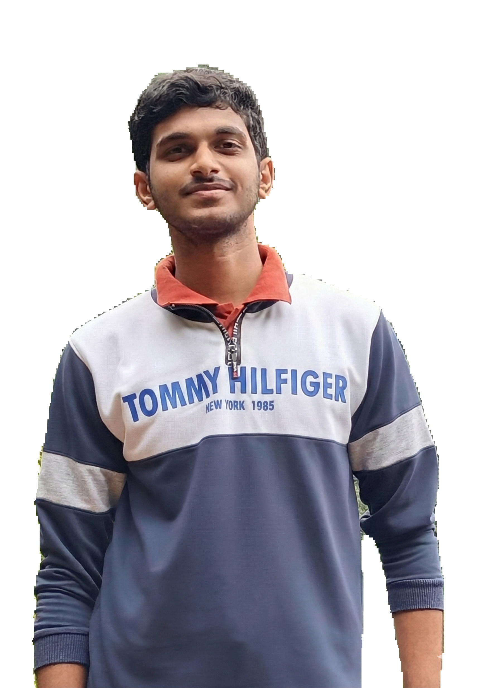

# RemBG: Background Removal using Deep Learning

A PyTorch-based deep learning project for automatic image background removal using semantic segmentation. This repository implements U-Net and ResNet50-U-Net architectures trained on image segmentation tasks to generate precise binary masks for background removal.

## Overview

RemBG leverages modern deep learning techniques to automatically segment and remove backgrounds from images. The project supports multiple model architectures and provides a complete training and inference pipeline.

**Key Features:**
- Dual model architectures: Standard U-Net and ResNet50-U-Net
- Hybrid loss function combining BCE and Dice loss for optimal segmentation
- Complete training pipeline with checkpoint management
- Inference API for real-time background removal
- Configurable dataset and training parameters
- GPU acceleration support (CUDA)

## Example Results

### Input & Output Comparison

| Original Image | Segmentation Mask |
|---|---|
|  |  |
|  |  |

The model successfully segments the foreground subject from the background, generating a precise binary mask suitable for background removal applications.


## Project Structure

```
├── dataset/
│   ├── original/
│   └── mask/
├── models/              # Pre-trained model checkpoints
├── output/              # Inference outputs
├── test_imgs/           # Test images
├── src/
│   ├── CONFIG.py        # Configuration parameters
│   ├── model.py         # Model architectures
│   ├── dataloader.py    # Dataset and DataLoader
│   └── loss.py          # Loss functions
├── train.py             # Training script
├── train.ipynb          # Training notebook
├── inference.ipynb      # Inference notebook
├── test.ipynb           # Testing and evaluation notebook
├── main.py              # Gradio interface
```

## Model Architectures

### U-Net
A lightweight semantic segmentation architecture with an encoder-decoder structure featuring skip connections:
- Efficient for smaller datasets
- Fast inference
- Lower memory requirements

### ResNet50-U-Net
An enhanced architecture combining ResNet50 as the encoder with U-Net's decoder:
- Better feature extraction through residual blocks
- Superior segmentation quality
- Recommended for production use

## Installation

### Requirements
- Python >=3.8
- PyTorch >=2.7.0
- CUDA 12.x (for GPU acceleration)
- Dependencies: torchvision, tqdm, numpy, PIL

### Setup

1. Clone or download the repository

2. Install dependencies:
```bash
pip install torch torchvision tqdm numpy pillow
```

3. Prepare your dataset:
```
dataset/
├── original/    # Your input images
└── mask/        # Corresponding segmentation masks (same filenames)
```

## Configuration

Edit `src/CONFIG.py` to customize training parameters:

```python
IMG_SIZE = (512, 512)          # Image input size
BATCH_SIZE = 4                 # Training batch size
LEARNING_RATE = 1e-4           # Learning rate
EPOCHS = 20                    # Number of training epochs
MODEL_TYPE = "resnet50_unet"   # "unet" or "resnet50_unet"
DEVICE = "cuda"                # "cuda" or "cpu"
LOAD = True                    # Load existing checkpoint
```

## Usage

### Training

Run the training pipeline:

```bash
python train.py
```

The training script will:
- The dataset used is [AIM 500](https://drive.google.com/drive/folders/1IyPiYJUp-KtOoa-Hsm922VU3aCcidjjz?usp=sharing)
- Load the dataset from `dataset/original` and `dataset/mask`
- Initialize the selected model architecture
- Train with BCE + Dice hybrid loss
- You can download the model from [Resnet unet 20](https://github.com/Hemanth2332/rembg/releases/download/resnet_unet/resnet50_unet_20.pth)
- Save checkpoints to `models/` directory
- Display training progress with loss metrics

### Inference

Use the `inference.ipynb` notebook to:
- Load a trained model
- Process images and generate background masks
- Save segmentation results to `output/` directory

Example notebook usage:
```python
from src.model import ResNet50_UNet
import torch

model = ResNet50_UNet(in_ch=3, out_ch=1)
checkpoint = torch.load("models/resnet50_unet_20.pth")
model.load_state_dict(checkpoint["model_state_dict"])
model.eval()

# Process images...
```

### Gradio Interface

```bash
python main.py
```

## Loss Function

The training uses a hybrid loss combining two complementary functions:

- **Binary Cross-Entropy (BCE):** Pixel-level classification loss
- **Dice Loss:** Region-level overlap metric for balanced segmentation

Combined loss:
$$L = \text{BCE}(y, \hat{y}) + \text{Dice}(y, \hat{y})$$

## Pre-trained Models

Place the pretrained model inside models folder.

## Dataset Format

**Required structure:**
- Original images: `dataset/original/image_001.jpg`, `image_002.jpg`, etc.
- Masks: `dataset/mask/image_001.png`, `image_002.png`, etc.
- Filenames must match between original and mask directories
- Supported formats: JPG, PNG

**Mask format:**
- Binary images (0 = background, 255 = foreground)
- Same dimensions as original images
- Preferably PNG format for lossless compression

## Notebooks

- **train.ipynb** - Interactive training notebook with visualization
- **inference.ipynb** - Load models and process images
- **test.ipynb** - Evaluate model performance on test set

## Technical Details

### Data Augmentation
- Random crops (512×512)
- Batch processing with DataLoader
- Normalized input tensors

### Training Features
- Mixed precision training (AMP) for efficiency
- Adam optimizer with learning rate scheduling
- Checkpoint save/restore capability
- Device-agnostic (CPU/GPU)

## Performance Considerations

- Recommended GPU: NVIDIA with 4GB+ VRAM
- Batch size: 4 (adjust based on available memory)
- Training time: ~2-4 hours per epoch on standard GPUs
- Inference: ~100ms per image (512×512)

## Future Improvements

- [x] Post-processing refinement (morphological operations)
- [x] Add Gradio support
- [ ] Inference optimization with ONNX export
- [ ] Additional data augmentation strategies
- [ ] Multi-GPU training support


## License

This project is provided as-is for research and educational purposes.

## References

- Ronneberger et al. (2015) - U-Net: Convolutional Networks for Biomedical Image Segmentation
- He et al. (2016) - Deep Residual Learning for Image Recognition
